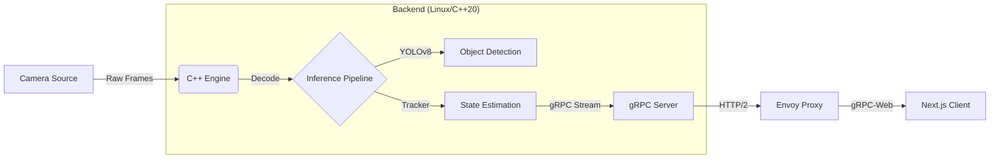

C'est la touche finale qui fait la différence. Un README de qualité "Ingénieur Senior" ne se contente pas de dire "comment installer". Il vend l'architecture, les choix techniques et la rigueur.

Voici le fichier `README.md` optimisé pour GitHub (avec support des badges et diagrammes Mermaid) et le message de commit parfait.

### 1. Le Fichier : `README.md`

Crée ce fichier à la racine du projet (`/Handball-Tactician/README.md`).

```markdown
# Handball Tactician


> **High-Frequency Computer Vision Pipeline for Real-Time Sports Analytics.**

## 📖 About
**Handball Tactician** is a distributed system designed to track players and ball trajectories in real-time from raw video feeds.

Unlike standard Python-based wrappers, this project implements a **high-performance C++ backend** handling video decoding, inference, and state estimation with strict latency constraints. Data is streamed continuously to a **Next.js** dashboard via **gRPC-Web**, bridging the gap between low-level systems programming and modern web visualization.

**Target Use Case:** Live tactical assistance for Handball coaches (Tablet/Laptop).

---

## 🏗 Architecture

The system follows a **Producer-Consumer** pattern designed for high throughput and low latency.



### Key Technical Features

* **Core Engine:** C++20 utilizing strict memory management and multi-threading (Thread Pool architecture).
* **Communication:** `gRPC` bidirectional streaming for real-time telemetry (no polling).
* **Infrastructure:** `Envoy Proxy` to translate HTTP/2 gRPC traffic for browser compatibility (gRPC-Web).
* **Frontend:** React/Next.js with custom hooks for socket management and Canvas API rendering.
* **Protocol:** Typed contract via `Protobuf` acting as the Single Source of Truth for both C++ and TypeScript.

---

## 🚀 Getting Started

### Prerequisites

* **OS:** Linux (Developed on KUbuntu 22.04) / Windows (via WSL2)
* **Compiler:** GCC 11+ or Clang 14+ (C++20 support required)
* **Tools:** CMake 3.20+, Docker, Node.js 18+

### 1. Build Backend (C++)

```bash
cd src/backend-cpp
mkdir build && cd build
cmake ..
make -j$(nproc)
./handball_engine

```

### 2. Launch Infrastructure

Start the Envoy Proxy to bridge the gRPC traffic.

```bash
docker compose up -d

```

### 3. Start Frontend

```bash
cd src/frontend-web
npm install
npm run dev

```

Access the dashboard at `http://localhost:3000`.

---

## 📂 Project Structure

This project is structured as a Monorepo to ensure contract consistency.

```text
/Handball-Tactician
├── /proto            # Single Source of Truth (.proto definitions)
├── /infrastructure   # Docker & Envoy configuration
├── /src
│   ├── /backend-cpp  # High-performance logic (OpenCV, gRPC)
│   └── /frontend-web # Visualization (Next.js, Tailwind)
└── /data             # Test footage and Model weights (Git ignored)

```

---

## 🛠 Roadmap

* [x] **Phase 1:** Environment Setup & gRPC Pipeline (C++ -> Web).
* [ ] **Phase 2:** Video Decoding & YOLO Integration (TensorRT).
* [ ] **Phase 3:** Multi-object Tracking Algorithm (SORT/DeepSORT).
* [ ] **Phase 4:** Live Camera Feed Integration.

## 👤 Author

Developed as a showcase of Systems Engineering & Full-Stack Robotics capabilities.

```
